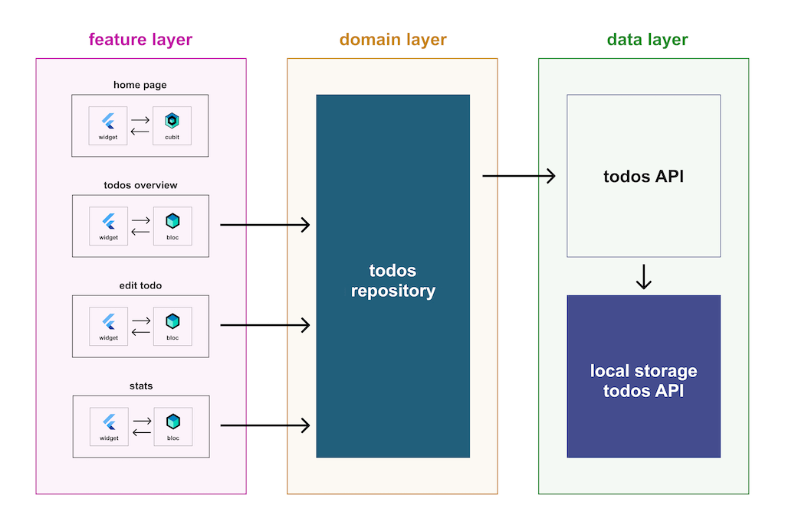

# sportsflow

A new Flutter project.

## Getting Started

This project is a starting point for a Flutter application.

A few resources to get you started if this is your first Flutter project:

- [Lab: Write your first Flutter app](https://docs.flutter.dev/get-started/codelab)
- [Cookbook: Useful Flutter samples](https://docs.flutter.dev/cookbook)

For help getting started with Flutter development, view the
[online documentation](https://docs.flutter.dev/), which offers tutorials,
samples, guidance on mobile development, and a full API reference.

# Lib Structure

## Architecture

Abstract classes

## 1. Data

services (=Status)

- Device Info
- Network
- Geo
- ...

respositories (=Data that can be manipulated)

- CRUD

datasources

- fetch data from all around the world
- API calls
- From and To JSON

## 2. Domain

Everything relevant for the Application
Includes:

- Abstract Repos
- Abstract Services
- Entities
- Usecases
  - CRUD Player

Folders:

- services (abstract)
- repos (abstract)
- usecases (Business Logic)
- entities (Interfaces/Types)

## 3. Presentation

Presenter/Provider (in our case Bloc) handles the communication between Usecases and the UI

Each Feature/Page has its own folder inside the features folder

Cubic is Bloc but without event trigger -> State change but no custom events

- Useful for simple things like just navigating to another page

One Gloal Bloc

- App State
- Navigation
-

Folders:

- features
  - bloc (Event, State)
  - pages (Structure of page)
  - widgets (Content of page)
- routes (Pages in AutoRoute format)

Files:

- DI config
  - perserves that communication only happens up
- main
- observed
  - BlocObserver -> Observes state changes (Something like logging)
